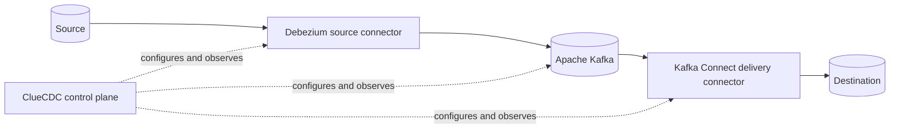

<p align="center">
  
</p>

# ClueCDC

[](https://github.com/cluedata/cluecdc/releases)
[](https://github.com/cluedata/cluecdc/actions/workflows/ci.yml)
[](https://cluedata.github.io/cluecdc/)
[](LICENSE)

**ClueCDC is an open-source control plane for building, managing, and monitoring
CDC pipelines powered by Debezium, Apache Kafka, and Kafka Connect.**

It gives operators one UI and API for connections, table discovery, connector
lifecycle, deliveries, health, alerts, and audit history. ClueCDC configures the
data plane; CDC records never flow through its API.

## Architecture



Debezium and delivery connectors run in Kafka Connect. The local stack uses one
worker; production may isolate or scale worker clusters independently.

## Features

- Reusable source, destination, Kafka, and Kafka Connect connections
- Source readiness checks, schema discovery, and explicit table selection
- Capture and delivery preview, deploy, pause, resume, restart, and removal
- Independent JDBC or object-storage deliveries from one capture pipeline
- Encrypted credentials, token authentication, structured logs, metrics, alerts,
  and an audit trail
- Docker Compose for local operation and a documented Kubernetes baseline

## Supported connectors

| System | Source | Destination | Delivery format |
| --- | --- | --- | --- |
| PostgreSQL 13+ | Debezium | JDBC sink | Typed rows/upserts/deletes |
| MySQL 8 | Debezium | JDBC sink | Typed rows/upserts/deletes |
| AWS S3 | No | Aiven S3 sink | Gzip JSONL CDC envelopes |
| MinIO | No | Aiven S3 sink | Gzip JSONL CDC envelopes |

## Quick start

Requirements: Git, Docker Engine or Docker Desktop, and Docker Compose v2. The
default stack needs enough memory for PostgreSQL, Kafka, Kafka Connect, the API,
worker, and web UI.

```bash
git clone https://github.com/cluedata/cluecdc.git
cd cluecdc
cp .env.example .env
docker compose up -d --build --wait
```

Open [http://localhost:3000](http://localhost:3000). The API reference is at
[http://localhost:8000/docs](http://localhost:8000/docs).

The copied values are safe only for loopback local development. Generate unique
local secrets before retaining data:

```bash
python scripts/bootstrap.py
```

Configuration is documented in [.env.example](.env.example) and the
[operations guide](docs/operations/configuration.md). Critical secrets are
required, and production mode rejects developer authentication and example keys.

## Deployment and documentation

The default Compose stack contains only runtime services. Development inspection
tools use `compose.dev.yaml`; PostgreSQL/MySQL/MinIO integration fixtures use
`compose.test.yaml`. See the [Compose guide](docs/getting-started/docker-compose.md),
[production considerations](docs/deployment/production.md), and
[Kubernetes baseline](docs/deployment/kubernetes.md).

Full documentation is at <https://cluedata.github.io/cluecdc/> and in [docs](docs/).
Start with the [architecture](docs/architecture/overview.md) and
[first pipeline](docs/getting-started/first-pipeline.md).

## Development

Use Node.js 24 and Python 3.12.

```bash
npm ci
python -m pip install -e "apps/api[dev]"
npm run verify
python -m ruff check apps/api scripts
python -m mypy --config-file apps/api/pyproject.toml apps/api/app
mkdocs build --strict
```

Run `python scripts/release-check.py --allow-dirty` for the complete local
release gate. It validates and builds but never tags, publishes, or pushes.

## Roadmap

Priorities before `v1.0.0` are production identity/SSO, TLS and external-secret
integration, broader Kafka security support, HA deployment guidance, and more
connector coverage. Planned work is not presented as current functionality.

## Project policies

Read [CONTRIBUTING.md](CONTRIBUTING.md) before proposing changes. Report
vulnerabilities privately according to [SECURITY.md](SECURITY.md). Releases use
Semantic Versioning and are recorded in [CHANGELOG.md](CHANGELOG.md).

ClueCDC is licensed under the [Apache License 2.0](LICENSE); see [NOTICE](NOTICE)
for bundled attribution.
