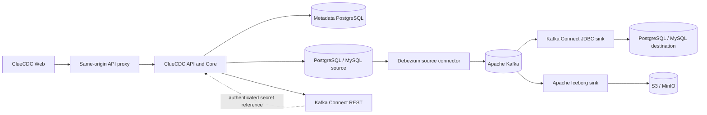

<p align="center">
  
</p>

# ClueCDC

[](https://github.com/cluedata/cluecdc/actions/workflows/ci.yml)
[](https://cluedata.github.io/cluecdc/)
[](LICENSE)

**The open-source control plane for Change Data Capture.**

ClueCDC helps developers and data engineers deploy, configure, operate, and
monitor CDC pipelines built on Debezium, Apache Kafka, and Kafka Connect without
managing every low-level configuration by hand.

> ClueCDC is early-stage software (`0.x`). The included Docker Compose topology
> is a local development/demo environment, not a production preset.

## Overview

ClueCDC is a self-hosted management plane. The FastAPI backend owns domain
validation, secrets, lifecycle state, connector configuration, and infrastructure
adapters. The Next.js UI talks only to the versioned API. CDC records remain in
the data plane—source databases, Kafka, Kafka Connect, and destinations—and are
not relayed or permanently stored by the ClueCDC API.

## Why ClueCDC

- Create capture and delivery flows through one consistent workflow.
- Keep Debezium and Kafka Connect details behind validated backend builders.
- Observe desired and actual connector state without presenting synthetic data.
- Run the Community Edition offline with infrastructure you control.
- Extend provider interfaces without forking Community business logic.

## Features

- PostgreSQL and MySQL source discovery, readiness, and connection diagnostics.
- Debezium source connector preview, validation, deployment, and lifecycle.
- PostgreSQL and MySQL JDBC destinations with independent fan-out connectors.
- Apache Iceberg Lakehouse delivery to Amazon S3 or MinIO using the built-in Hadoop catalog.
- Kafka cluster, topic, partition, and bounded event inspection.
- Connector/task status, restart, pause, resume, audit, and incident workflows.
- Encrypted database credentials and Kafka Connect secret references.
- Versioned REST API, structured logs, Prometheus metrics, health, and readiness.
- Helpful empty states; no default fake pipelines, analytics, or metrics.

## Architecture



See [architecture](docs/architecture/overview.md), [control plane](docs/architecture/control-plane.md),
and [pipeline lifecycle](docs/architecture/pipeline-lifecycle.md).

## Supported sources

| Source     | Capture | Discovery | Connection test |
| ---------- | ------- | --------- | --------------- |
| PostgreSQL | Yes     | Yes       | Yes             |
| MySQL 8.4  | Yes     | Yes       | Yes             |

SQL Server is documented as planned and is not exposed as working functionality.

## Supported destinations

| Destination | Delivery | Mapping validation | Connection test |
| ----------- | -------- | ------------------ | --------------- |
| PostgreSQL  | Yes      | Yes                | Yes             |
| MySQL 8.4   | Yes      | Yes                | Yes             |

Lakehouse support writes Apache Iceberg data and metadata directly to Amazon S3
or MinIO through the built-in Hadoop catalog. See the [Lakehouse overview](docs/lakehouse/overview.md).

## Quick start

Prerequisites: Docker Engine/Desktop with Compose v2, Git, and approximately
6 GB of available Docker memory.

```bash
git clone https://github.com/cluedata/cluecdc.git
cd cluecdc
cp .env.example .env
docker compose up -d --build --wait
```

Add the optional local Lakehouse stack with:

```bash
docker compose --profile lakehouse up -d --build --wait
```

Open [http://localhost:3000](http://localhost:3000). The API reference is at
[http://localhost:8000/docs](http://localhost:8000/docs).

The checked-in example values are development-only and all published services
bind to loopback. Before retaining local data, replace them with unique values:

```bash
python scripts/bootstrap.py
docker compose up -d --build
```

Do not use `.env.example` credentials in a shared or production environment.

## Docker Compose

The default topology includes ClueCDC Web/API, metadata PostgreSQL, one Kafka
broker, Kafka Connect with Debezium/JDBC, PostgreSQL and MySQL demo endpoints,
and a CloudBeaver database explorer. It starts with an empty ClueCDC workspace;
sample rows are database fixtures, never production application data.

```bash
docker compose ps
docker compose logs -f cluecdc-api kafka-connect
docker compose down
```

Named volumes survive `down`. Deleting them removes metadata, source/destination
data, Kafka history, and explorer settings. See the [Compose guide](docs/getting-started/docker-compose.md)
and [end-to-end walkthrough](user_guide.md).

## Configuration

Configuration is read from environment variables and validated when the API
starts. The central backend schema is `apps/api/app/core/config.py`; web server
configuration is in `apps/web/src/lib/server-config.ts`. Required secrets have
no backend defaults. `ENVIRONMENT=production` rejects developer authentication
and the documented example encryption/service values.

See [.env.example](.env.example) and the [configuration reference](docs/operations/configuration.md).

## Screenshots

The live UI is available immediately after Quick Start. The [user guide](user_guide.md)
provides page-by-page workflows. Repository documentation intentionally avoids
staged dashboards or screenshots containing generated credentials; release
screenshots will be added only from sanitized, reproducible fixtures.

## Documentation

The official documentation is published at **https://cluedata.github.io/cluecdc/**.

- [Alerting and notifications](docs/alerting.md)

- [Quick start](docs/getting-started/quick-start.md)
- [Architecture](docs/architecture/overview.md)
- [API v1](docs/api/overview.md)
- [PostgreSQL](docs/connectors/postgresql.md) and [MySQL](docs/connectors/mysql.md)
- [Operations and troubleshooting](docs/operations/troubleshooting.md)
- [User guide](user_guide.md)

Build the documentation locally with `python -m pip install -r requirements-docs.txt`
and `mkdocs serve`. Kubernetes deployment assets are under `deploy/kubernetes`.

## Development

Use Node.js 24 and Python 3.12.

```bash
npm ci
python -m pip install -e "apps/api[dev]"
npm run format:check
npm run lint
npm run typecheck
npm test
npm run build
```

Live smoke/E2E checks require the Compose stack. See [development setup](docs/development/setup.md)
and [verification](docs/development/verification.md).

## Roadmap

Planned Community work includes production deployment guidance, broader Kafka
security modes, connector SDK ergonomics, and additional verified providers.
SSO, advanced RBAC/audit, multi-cluster HA, enterprise secret stores, and hosted
control-plane capabilities are possible future commercial extensions; none are
presented as Community features today.

## Contributing

Read [CONTRIBUTING.md](CONTRIBUTING.md), [GOVERNANCE.md](GOVERNANCE.md), and the
[Code of Conduct](CODE_OF_CONDUCT.md). Focused issues and pull requests are
welcome. New integrations must include tests, documentation, capability metadata,
and explicit secret/error behavior.

## Security

Do not open a public issue for a vulnerability. Read [SECURITY.md](SECURITY.md)
for supported versions, private-reporting requirements, and deployment guidance.

## Community

Use [GitHub issues](https://github.com/cluedata/cluecdc/issues) for confirmed bugs
and scoped proposals. See [SUPPORT.md](SUPPORT.md) before requesting help. No
external ClueCDC service, account, license server, or telemetry endpoint is
required to run Community Edition.

## License

ClueCDC is licensed under the [Apache License 2.0](LICENSE). Third-party notices
are listed in [NOTICE](NOTICE).
