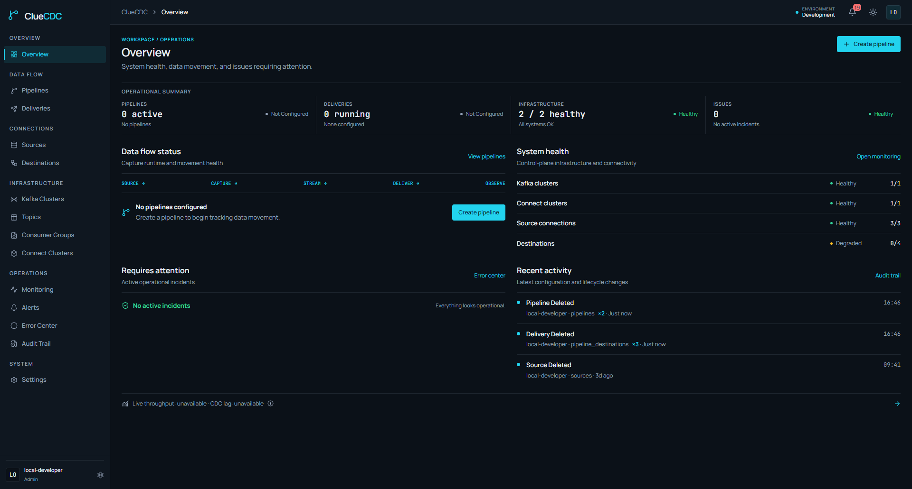
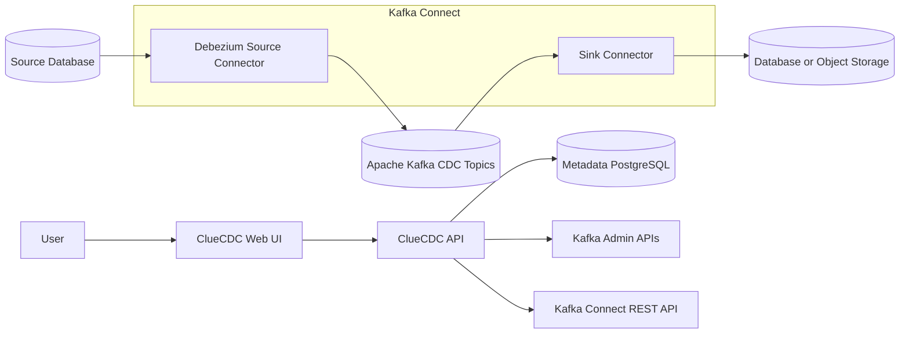

<p align="center">
  
</p>

# ClueCDC

[](https://github.com/cluedata/cluecdc/actions/workflows/ci.yml)
[](https://cluedata.github.io/cluecdc/)
[](LICENSE)

**ClueCDC is an open-source control plane for building, managing, and monitoring
CDC pipelines powered by Debezium, Apache Kafka, and Kafka Connect.**

ClueCDC manages infrastructure configuration and lifecycle; it does not relay
CDC records through its API.

## Architecture



Debezium runs as a Kafka Connect source connector. Local Compose uses one Connect
worker for source and sink connectors. Production deployments may use separate,
horizontally scaled Connect worker clusters for isolation and capacity.

## Supported connectors

| Type | Source | Destination | Connection test | CDC status |
| --- | --- | --- | --- | --- |
| PostgreSQL | Yes | Yes | Yes | Supported |
| MySQL | Yes | Yes | Yes | Supported |
| AWS S3 | No | Yes | Yes | JSONL archive |
| MinIO | No | Yes | Yes | JSONL archive |

The Connect image contains the Debezium PostgreSQL and MySQL source connectors
and Debezium JDBC sink connector, plus the Apache-2.0 Aiven S3 sink pinned to
3.4.2 with a verified artifact checksum. [Object storage deliveries](docs/connectors/object-storage.md)
preserve CDC envelopes, including delete events, in gzip JSONL files.

## Quick start

Prerequisites are Docker Engine or Docker Desktop with Compose v2 and Git.

```bash
git clone https://github.com/cluedata/cluecdc.git
cd cluecdc
cp .env.example .env
docker compose up -d --build
```

Open [http://localhost:3000](http://localhost:3000). The API reference is at
[http://localhost:8000/docs](http://localhost:8000/docs).

The default stack starts six services: metadata PostgreSQL, one KRaft Kafka
broker, Kafka Connect, the HTTP API, a separate ClueCDC background worker, and
the web UI. Source/destination databases and MinIO are integration fixtures only.

The metadata schema uses a clean baseline with a data-preserving upgrade bridge
for prototype revision `5e2d8a9f1c30`. Back up existing metadata before upgrading;
other old revisions require a fresh database. See the [migration decision](docs/development/migrations.md).

Optional developer tooling:

```bash
docker compose -f compose.yaml -f compose.dev.yaml up -d
```

Integration and E2E fixtures:

```bash
docker compose -f compose.yaml -f compose.test.yaml up -d --build --wait
```

The example secrets are for loopback-only development. Generate unique local
values before retaining or sharing data:

```bash
python scripts/bootstrap.py
```

## Development

Use Node.js 24 and Python 3.12.

```bash
npm ci
python -m pip install -e "apps/api[dev]"
npm run format:check
npm run lint
npm run typecheck
npm test
npm run build
mkdocs build --strict
```

See the [architecture](docs/architecture/overview.md),
[Docker deployment](docs/getting-started/docker-compose.md),
[Kubernetes deployment](docs/deployment/kubernetes.md), and
[contribution guide](CONTRIBUTING.md).

## Security and support

Do not open a public issue for a vulnerability. Follow [SECURITY.md](SECURITY.md).
For usage and contribution expectations, see [SUPPORT.md](SUPPORT.md) and
[GOVERNANCE.md](GOVERNANCE.md).

## License

Apache License 2.0. See [LICENSE](LICENSE) and [NOTICE](NOTICE).
