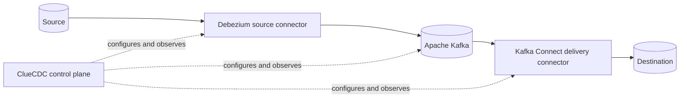

<p align="center">
  
</p>

# ClueCDC

[](https://github.com/cluedata/cluecdc/releases)
[](https://github.com/cluedata/cluecdc/actions/workflows/ci.yml)
[](https://cluedata.github.io/cluecdc/)
[](LICENSE)

**ClueCDC is an open-source control plane for building, managing, and monitoring
CDC pipelines powered by Debezium, Apache Kafka, and Kafka Connect.**

It gives operators one UI and API for connections, table discovery, connector
lifecycle, deliveries, health, alerts, and audit history. ClueCDC configures the
data plane; CDC records never flow through its API.

## Architecture



Debezium and delivery connectors run in Kafka Connect. The local stack uses one
worker; production may isolate or scale worker clusters independently.

## Features

### CDC and pipeline management

- [x] PostgreSQL 13+ and MySQL 8 source capture with Debezium
- [x] Reusable source, Kafka, Kafka Connect, and destination connections
- [x] Connection tests, schema/table discovery, CDC readiness, key, and type checks
- [x] Explicit table selection and initial, streaming-only, never, or always snapshots
- [x] Five-step UI wizard that validates and deploys capture plus its first delivery
- [x] Pipeline preview, deploy, pause, resume, restart, task restart, and deletion
- [x] Add, remove, resnapshot, stop, monitor, and retry per-table operations
- [x] Desired-state and observed connector/task health tracking

### Delivery and infrastructure

- [x] Multiple independently operated deliveries from one capture pipeline
- [x] PostgreSQL and MySQL JDBC delivery with explicit topic-to-table mappings
- [x] Insert/upsert modes, delete propagation, table creation, and basic schema evolution
- [x] AWS S3 and MinIO delivery as gzip or plain JSONL CDC envelopes
- [x] Delivery preview, deploy, mapping update, pause, resume, restart, task restart, and removal
- [x] Kafka cluster, topic, partition, offset, and consumer-group metadata inspection
- [x] Kafka Connect cluster, plugin, connector, and task inventory

### Operations, access, and platform

- [x] Overview, monitoring, Error Center, alert lifecycle, and audit trail
- [x] Alert rules plus Slack, Telegram, and generic webhook notification channels
- [x] Local email/password login, opaque browser sessions, and expiring single-use invites
- [x] Built-in Viewer, Ops, and Admin roles with API enforcement and role-aware navigation
- [x] Admin user management: invite, role change, enable, disable, and guarded deletion
- [x] Argon2id password hashing with a minimum password length of 8 characters
- [x] Encrypted connection/channel credentials and Kafka Connect secret references
- [x] Structured logs, correlation IDs, health endpoints, and Prometheus metrics
- [x] FastAPI/OpenAPI API, Next.js UI, background worker, and Alembic migrations
- [x] Docker Compose local stack and a documented Kubernetes deployment baseline

ClueCDC deliberately does not relay CDC payloads through its API. Topic screens
show broker metadata; inspect records directly in Kafka or the configured
destination. See the [current feature matrix](docs/features.md) for detailed
capabilities, role access, and known boundaries.

## Supported connectors

| System | Source | Destination | Delivery format |
| --- | --- | --- | --- |
| PostgreSQL 13+ | Debezium | JDBC sink | Typed rows/upserts/deletes |
| MySQL 8 | Debezium | JDBC sink | Typed rows/upserts/deletes |
| AWS S3 | No | Aiven S3 sink | Gzip JSONL CDC envelopes |
| MinIO | No | Aiven S3 sink | Gzip JSONL CDC envelopes |

## Quick start

Requirements: Git, Docker Engine or Docker Desktop, and Docker Compose v2. The
default stack needs enough memory for PostgreSQL, Kafka, Kafka Connect, the API,
worker, and web UI.

```bash
git clone https://github.com/cluedata/cluecdc.git
cd cluecdc
cp .env.example .env
python scripts/bootstrap.py
docker compose up -d --build --wait
```

Open [http://localhost:3000/login](http://localhost:3000/login). The API reference is at
[http://localhost:8000/docs](http://localhost:8000/docs).

The development stack creates this public demo account automatically:

```text
Email:    admin@cluecdc.local
Password: cluecdc-admin
```

Do not expose this account to a network or reuse its metadata database in
production. Production rejects `BOOTSTRAP_DEFAULT_ADMIN=true`; disable it and
create the first administrator interactively with `python -m app.cli
create-admin`.

The bootstrap command replaces infrastructure and cryptographic examples with
unique local secrets without overwriting custom values. It deliberately keeps
the public development login shown above so a fresh local stack is accessible.

Configuration is documented in [.env.example](.env.example) and the
[operations guide](docs/operations/configuration.md). Critical secrets are
required, and production mode rejects non-session authentication and example
keys. See [authentication](docs/security/authentication.md) and
[user management](docs/operations/user-management.md).

## Deployment and documentation

The default Compose stack contains only runtime services. Development inspection
tools use `compose.dev.yaml`; PostgreSQL/MySQL/MinIO integration fixtures use
`compose.test.yaml`. See the [Compose guide](docs/getting-started/docker-compose.md),
[production considerations](docs/deployment/production.md), and
[Kubernetes baseline](docs/deployment/kubernetes.md).

Full documentation is at <https://cluedata.github.io/cluecdc/> and in [docs](docs/).
Start with the [architecture](docs/architecture/overview.md) and
[first pipeline](docs/getting-started/first-pipeline.md).

## Development

Use Node.js 24 and Python 3.12.

```bash
npm ci
python -m pip install -e "apps/api[dev]"
npm run verify
python -m ruff check apps/api scripts
python -m mypy --config-file apps/api/pyproject.toml apps/api/app
mkdocs build --strict
```

Run `python scripts/release-check.py --allow-dirty` for the complete local
release gate. It validates and builds but never tags, publishes, or pushes.

## Roadmap

Priorities before `v1.0.0` are production identity/SSO, TLS and external-secret
integration, broader Kafka security support, HA deployment guidance, and more
connector coverage. Planned work is not presented as current functionality.

## Project policies

Read [CONTRIBUTING.md](CONTRIBUTING.md) before proposing changes. Report
vulnerabilities privately according to [SECURITY.md](SECURITY.md). Releases use
Semantic Versioning and are recorded in [CHANGELOG.md](CHANGELOG.md).

ClueCDC is licensed under the [Apache License 2.0](LICENSE); see [NOTICE](NOTICE)
for bundled attribution.

## Donation

If ClueCDC is useful to you, you can support its continued development at
[Buy Me a Coffee](https://buymeacoffee.com/khanhvlq).
