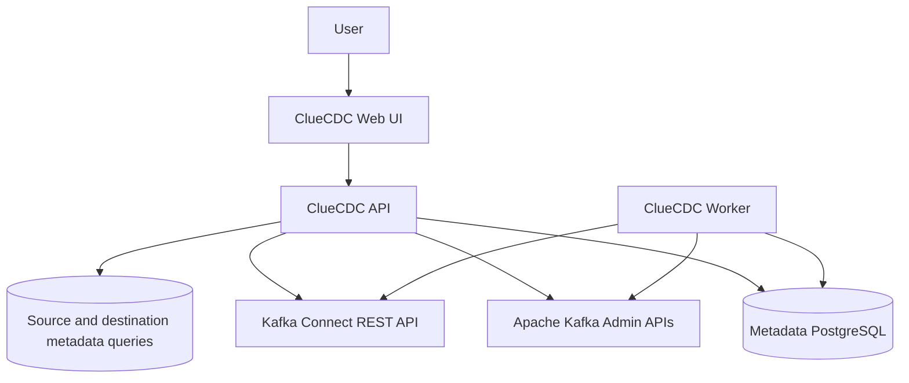
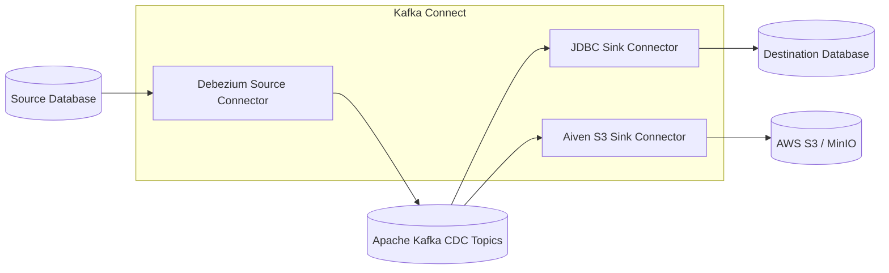
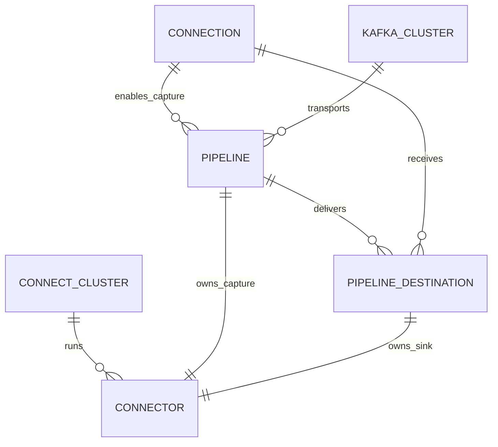

# Architecture

ClueCDC is a control plane around a Kafka Connect CDC data plane. Its API stores
configuration and operational state, calls management APIs, and performs bounded
metadata queries. CDC records never pass through the backend. Topic inspection
returns broker metadata only; payload verification reads Kafka or storage directly.

## Control plane

The control plane owns:

- reusable source and destination connection configuration;
- pipeline, connector, topic, and table lifecycle;
- desired state and observed Kafka Connect task state;
- encrypted credential references;
- monitoring, alerts, audit records, and application metrics.

The API manages Kafka through admin/consumer APIs and Kafka Connect through its
REST API. It uses database metadata queries for discovery, readiness checks, and
destination validation.

## CDC data plane

Debezium is a Kafka Connect source connector, not a separate ClueCDC or
standalone service. A simple environment can run capture and delivery connectors
on one worker cluster. Production can separate source and sink worker clusters
and scale each distributed cluster horizontally; Kafka Connect then rebalances
connector tasks among workers.

## Implemented connector matrix

| Type | Source | Destination | Connection test | CDC | Status |
| --- | --- | --- | --- | --- | --- |
| PostgreSQL | Debezium | JDBC sink | Yes | Yes | Supported |
| MySQL | Debezium | JDBC sink | Yes | Yes | Supported |
| AWS S3 | No | Aiven S3 sink | Yes | Raw CDC export | Supported |
| MinIO | No | Aiven S3 sink | Yes | Raw CDC export | Supported |

This matrix is based on provider adapters, connector configuration builders, and
tests in the source tree. Providers without those runtime paths are not exposed
in the UI or documentation.

## Domain relationships

- A **Connection** is a reusable database or object-storage endpoint with
  source/destination capabilities, not a persisted mirror entity.
- A **Pipeline** owns a Debezium source connector and selected source tables.
- A **Delivery** associates a pipeline with a destination and owns a JDBC or S3 sink
  connector.
- A **Connector** is ClueCDC metadata for a concrete Kafka Connect resource.
- Topics are discovered and managed through Kafka; deleting a pipeline does not
  silently delete its topics.

## Local and production topology

Local Compose intentionally uses one metadata database, broker, Connect worker,
API, independent control-plane worker and web process. It is a development
topology, not simulated HA.

Production should use replicated Kafka, multiple distributed Connect workers,
managed or highly available PostgreSQL metadata, multiple stateless API/web
replicas behind ingress, TLS and authentication, durable storage, secret
management, and monitoring. Kafka itself is an external dependency in the
Kubernetes baseline.
