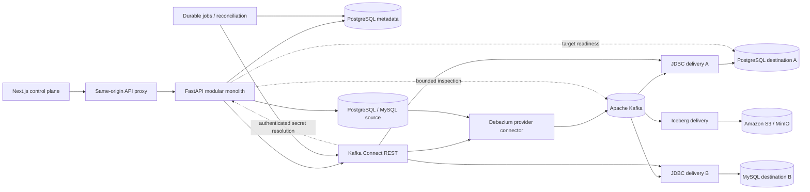
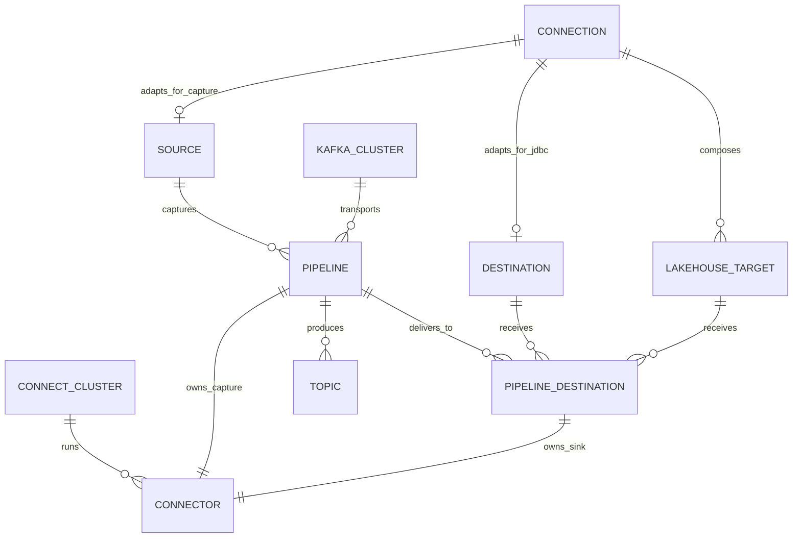

# Architecture

The backend is a modular monolith, with transport contracts, persistence models, adapters, services, and worker boundaries. The data plane remains responsible for CDC transport and offsets. External dependencies produce explicit errors; runtime failures never become successful simulated results.

Capture and delivery support PostgreSQL and MySQL. A provider registry owns source/destination adapters, Debezium configuration, immutable identity keys, signaling/publication behavior, JDBC URLs, metadata, and capabilities. The pipeline core consumes these contracts. A logical type layer performs source-type parsing, compatibility classification, and target-dialect mapping before delivery deployment. Domain entities for metrics, alerts, and Kafka topics do not imply active collectors/evaluators.

Connection is the canonical encrypted external-system resource. Source and
Destination are compatibility adapters for capture and JDBC runtimes and share
the canonical connection ID. PipelineDestination connects an existing pipeline
to a database connection or composite LakehouseTarget through independently
managed sink Connector metadata and offsets. The worker reconciles captures and
deliveries separately; it reports observed task failures and records meaningful
state changes. A sink-side transformation reconstructs typed JDBC records from
the existing schemaless JSON capture format, preserving capture behavior. See
the [connector details](../connectors/postgresql-destination.md).

SourceAdapter/secret calls are async; Kafka/Connect calls are bounded by deadlines. The API uses a PostgreSQL-backed queue for discovery and health. One API process hosts the worker in this release; the interfaces can move to a separate worker/task queue.

## Domain relationships

- A **Connection** is a reusable database, object storage, catalog, or query
  engine endpoint with write-only encrypted credentials and explicit capabilities.
- **Sources** and **Destinations** are filtered Connection views; compatibility
  adapter rows keep existing pipeline and delivery foreign keys stable.
- A **LakehouseTarget** combines object storage and Iceberg delivery settings.
  Legacy catalog/query-engine columns remain only for database compatibility and
  are not part of the current public storage-only contract.
- A **Delivery** is the first-class domain/UX view of an existing managed sink
  connector (`PipelineDestination` + sink `Connector`); it is not a duplicate runtime.
- A **Pipeline** is the central end-to-end data-flow view: Source → Capture →
  Stream → one or more Deliveries → Destinations. The current backend persists
  the capture definition and relationships, while the frontend/API aggregate the
  complete topology deterministically from those existing records.
- A **Connector** is ClueCDC metadata for a concrete Kafka Connect resource.
- A **Topic** is discovered from Kafka and is not deleted with a pipeline.
- A **Cluster** represents either Kafka bootstrap servers or a Kafka Connect REST endpoint.

The primary UI navigation follows the domain language: Pipelines, Deliveries,
Connections (with Sources and Destinations as filtered views), then Kafka
infrastructure and operations. Debezium and
Kafka Connect remain visible as secondary implementation details on configuration,
runtime, task, and log views.

## Community and extension boundary

Community services depend on protocols and registries, not edition flags.
`DatabaseProvider`, `AuthProvider`, `SecretProvider`, `KafkaConnectClient`, and
the Kafka adapter are composition seams. Community supplies database providers,
developer/token authentication, and encrypted metadata-database secrets. A
future extension may register another implementation at composition time, but
Community code must remain runnable without it and may not call a license or
hosted ClueCDC service.
