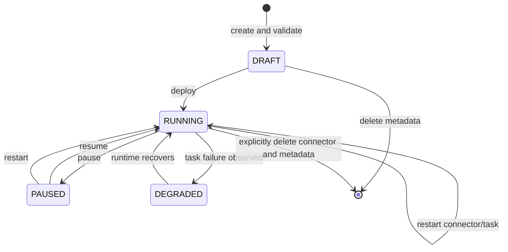

# Pipeline lifecycle

Pipeline metadata and the Kafka Connect runtime are separate systems. ClueCDC
stores both desired and last observed state; the UI never infers connector state
from labels or a single successful HTTP request.

Creation validates Debezium configuration but does not deploy. Deployment first
provisions required topics, creates the connector, then commits runtime metadata;
failure is explicit and compensating cleanup is attempted where safe. The worker
periodically maps Kafka Connect connector/task state to ClueCDC domain state.

Deleting a pipeline is explicit. It does not delete Kafka topics, messages,
source tables, destination tables, replication publications, or slots. Kafka
topic deletion is a separate API/UI operation with a permanent-data-loss warning.
Deleting a destination is blocked while deliveries reference it.
