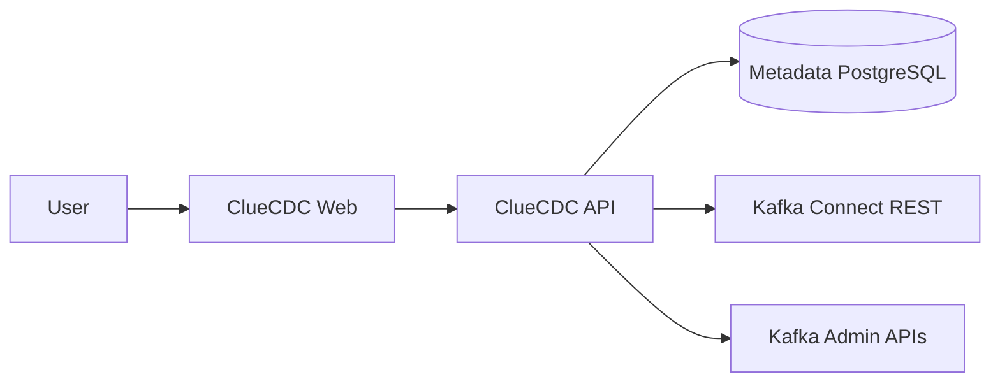
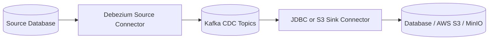

# Operate CDC without hiding the data plane

ClueCDC is an open-source control plane for configuring, operating, and
monitoring Change Data Capture pipelines powered by Debezium, Apache Kafka, and
Kafka Connect.

[Quick start](getting-started/quick-start.md){ .md-button .md-button--primary }
[Architecture](architecture/overview.md){ .md-button }

## What ClueCDC manages

- PostgreSQL and MySQL source discovery and CDC readiness.
- Debezium source connector configuration and lifecycle.
- Kafka clusters, topic/partition/offset metadata, and consumer groups.
- PostgreSQL and MySQL JDBC deliveries with explicit table mappings.
- AWS S3 and MinIO JSONL deliveries through the Aiven S3 sink.
- Kafka Connect plugins, connectors, tasks, and independent delivery lifecycle.
- Local users and sessions, three-role authorization, alerts, audit records,
  encrypted secret references, health endpoints, and application metrics.

See the [current feature matrix](features.md) for the complete implemented
surface and explicit product boundaries. CDC payloads never pass through the
ClueCDC API; topic inspection is metadata-only.

## Control plane and data plane





Debezium runs inside Kafka Connect. The API is never inserted into record
transport.

## Supported connectors

| System | Source capture | Destination delivery | Connection test |
| --- | --- | --- | --- |
| PostgreSQL | Supported | Supported | Supported |
| MySQL | Supported | Supported | Supported |
| AWS S3 | No | Supported | Supported |
| MinIO | No | Supported | Supported |

## Start locally

```bash
git clone https://github.com/cluedata/cluecdc.git
cd cluecdc
cp .env.example .env
python scripts/bootstrap.py
docker compose up -d --build --wait
```

Open `http://localhost:3000/login` and sign in with
`admin@cluecdc.local` / `cluecdc-admin`. This public account is only for the
loopback development stack. The default stack contains six runtime services;
developer tools and integration fixtures are separate Compose overrides.

Next: [create your first pipeline](getting-started/first-pipeline.md).
