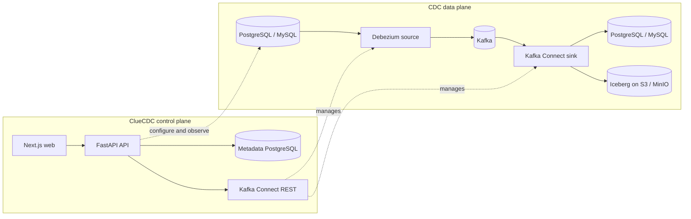

# Change data, under control

ClueCDC is the open-source control plane for configuring, operating, and observing CDC pipelines built on Debezium, Apache Kafka, and Kafka Connect.

[Get started :material-arrow-right:](getting-started/introduction.md){ .md-button .md-button--primary }
[View architecture](architecture/overview.md){ .md-button }

!!! warning "Early-stage software"
    ClueCDC is in the `0.x` series. Docker Compose is a local development and evaluation topology, not a production preset.

-   :material-database-sync:{ .lg .middle } **Build a CDC pipeline**

    ---

    Capture PostgreSQL or MySQL changes and deliver them to PostgreSQL, MySQL, or Apache Iceberg.

    [:octicons-arrow-right-24: First pipeline](getting-started/first-pipeline.md)

-   :material-vector-link:{ .lg .middle } **Understand the data flow**

    ---

    See exactly where ClueCDC's control plane ends and Debezium, Kafka, and Connect carry the data plane.

    [:octicons-arrow-right-24: Architecture](architecture/overview.md)

-   :material-heart-pulse:{ .lg .middle } **Operate with evidence**

    ---

    Inspect desired and actual connector state, bounded event samples, alerts, audits, and Prometheus metrics.

    [:octicons-arrow-right-24: Operations](operations/monitoring.md)

-   :material-kubernetes:{ .lg .middle } **Choose your deployment**

    ---

    Start locally with Compose or deploy the control plane and Kafka Connect baseline on Kubernetes.

    [:octicons-arrow-right-24: Deployment](deployment/kubernetes.md)

## Actual data flow

ClueCDC stores configuration, desired state, encrypted credentials, audit records, and operational observations. CDC row events stay in Kafka and destination systems; the API does not relay them.

## What is implemented

| Area | Current support |
| --- | --- |
| Sources | PostgreSQL and MySQL discovery, readiness checks, Debezium deployment |
| Database destinations | PostgreSQL and MySQL through the Debezium JDBC sink |
| Lakehouse | Apache Iceberg files and metadata on Amazon S3 or MinIO using the Hadoop catalog |
| Lifecycle | Deploy, pause, resume, add/remove tables, resnapshot, retry, delete |
| Operations | Kafka/Connect inspection, bounded event sampling, audit, alerts, structured logs, Prometheus endpoint |
| Security | Fernet-encrypted stored secrets, Connect secret references, developer or token authentication |

SQL Server, Trino query-engine management, SSO, and production-ready Kafka security automation are not implemented.
