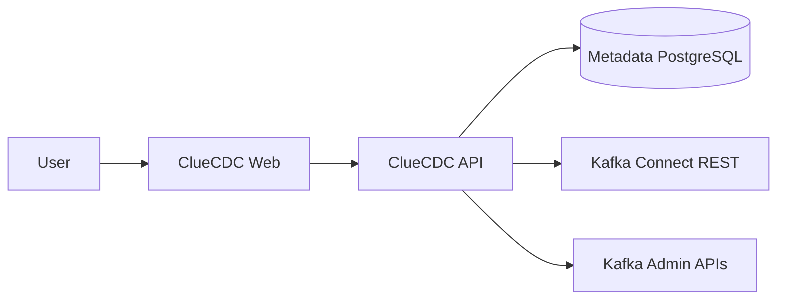
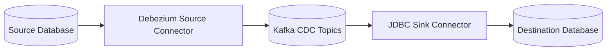

# Operate CDC without hiding the data plane

ClueCDC is an open-source control plane for configuring, operating, and
monitoring Change Data Capture pipelines powered by Debezium, Apache Kafka, and
Kafka Connect.

[Quick start](getting-started/quick-start.md){ .md-button .md-button--primary }
[Architecture](architecture/overview.md){ .md-button }

## What ClueCDC manages

- PostgreSQL and MySQL source discovery and CDC readiness.
- Debezium source connector configuration and lifecycle.
- Kafka clusters, topics, partitions, and bounded event inspection.
- PostgreSQL and MySQL JDBC deliveries with explicit table mappings.
- Kafka Connect connector and task status.
- Alerts, audit records, encrypted secret references, and application metrics.

## Control plane and data plane





Debezium runs inside Kafka Connect. The API is never inserted into record
transport.

## Supported connectors

| Database | Source capture | Destination delivery | Connection test |
| --- | --- | --- | --- |
| PostgreSQL | Supported | Supported | Supported |
| MySQL | Supported | Supported | Supported |

## Start locally

```bash
git clone https://github.com/cluedata/cluecdc.git
cd cluecdc
cp .env.example .env
docker compose up -d --build
```

Open `http://localhost:3000`. The default stack contains only the five core
runtime services. Developer tools and integration fixtures are separate Compose
overrides.

Next: [create your first pipeline](getting-started/first-pipeline.md).
